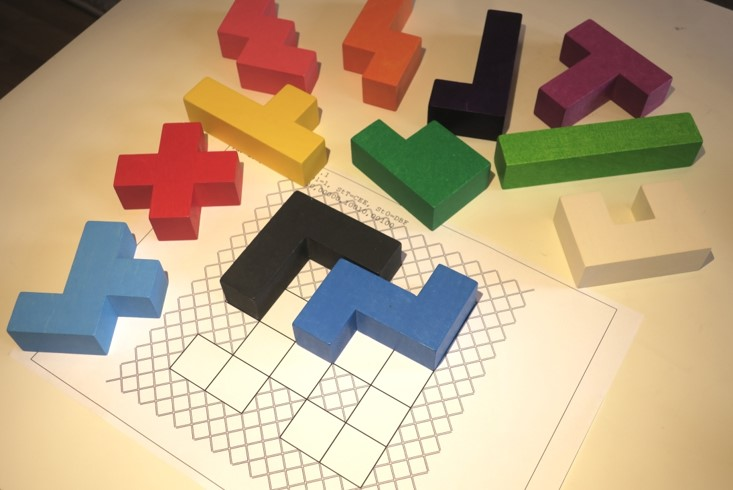
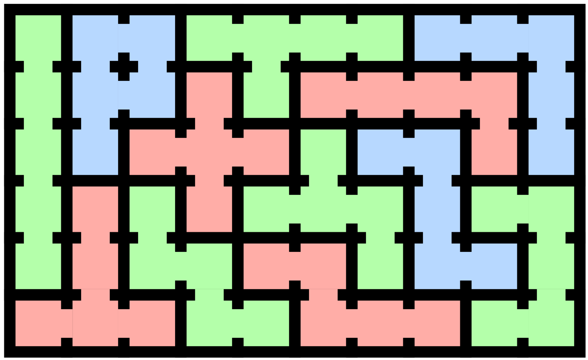
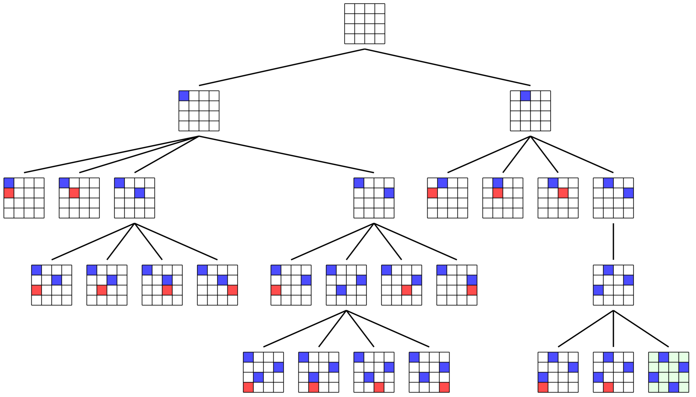
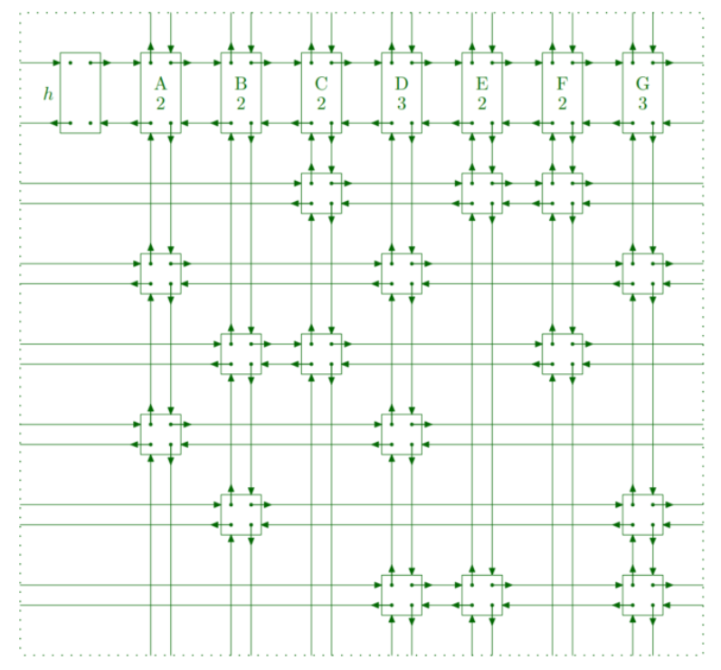
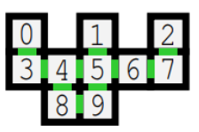
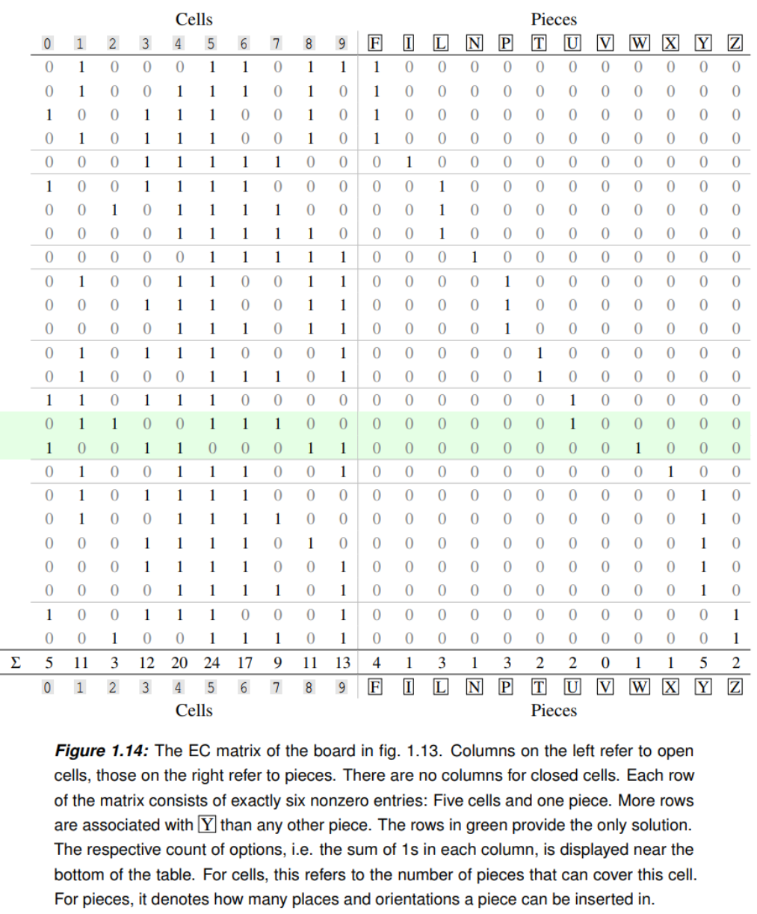
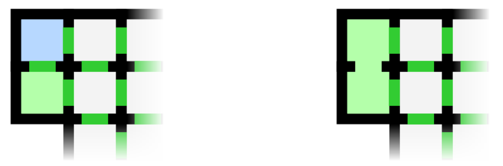
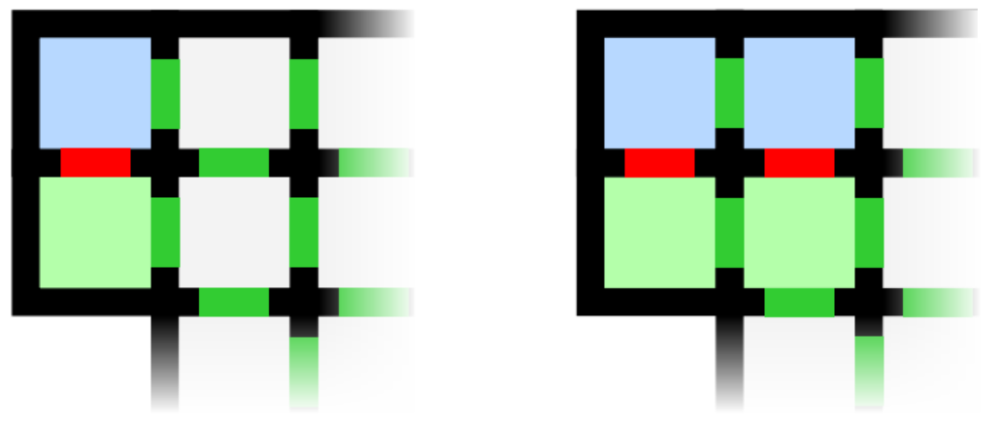
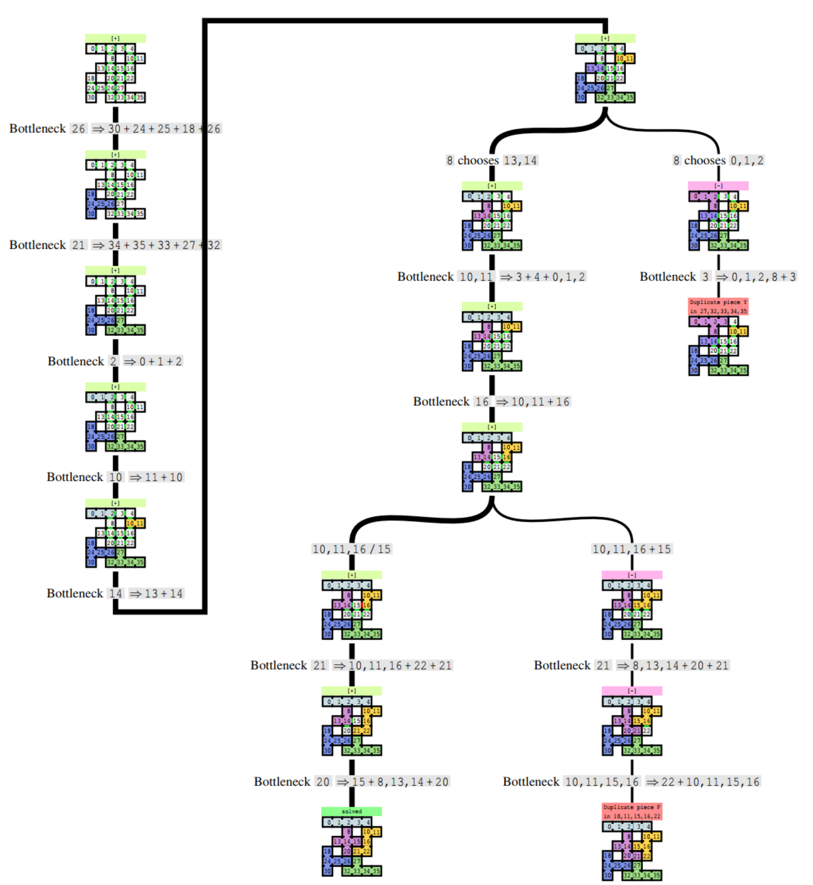
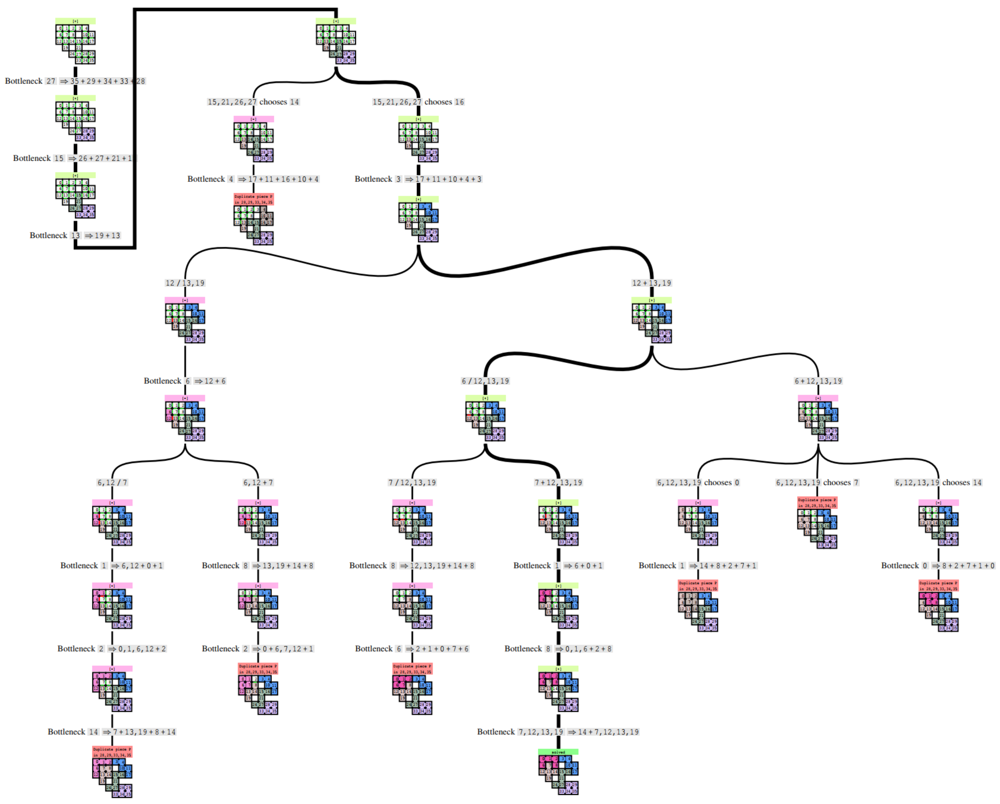

# Minotaur

This is the source code of Minotaur, a program for the Pentomino board game, along some supplementary documentation and data.

Minotaur can solve Pentomino boards, using either classical pieces or (our proposed approach) fancy strings.
As Pentomino is NP-complete, it will intentionally explore the entire worst case path before it is forced to arrive at a solution.
By default, it makes use of several reasoning shortcuts, ranging from trivial to complex, to do this efficiently.
If given some thinking time, it can further optimize the reasoning using MCTS and calculate a particularly short path.

It will present you the solution either as a graph or as a linearized explanation.
Boards and solution graphs can be exported in a variety of formats, which depending on the purpose include HTML/SVG, JSON, Latex/Tikz, Surface-compatible or printing on DIN A4, ANSI or colored console, and some composites.

If you've run out of Pentomino boards, it can generate new ones:
It is able to efficiently enumerate all board permutations of all possible configurations.
In case you happen to have a few hundred machines lying around, it can do this in a distributed fashion, too.
You may opt to receive only boards with a unique solution, as those are perhaps the most interesting.

Apart from that, it can optimize its own heuristic, i.e. the guideline it follows to solve boards more quickly.
The heuristic, along the entire string-based solving approach, was specifically designed to be understandable for and applicable by humans.
If you want to take a look, and potentially even improve your game skill, you may be interested in our upcoming article.
We will link to it when it is ready.

## About this project

I began work on this topic around 2019, when I was fresh into the MSc program.
The initial spark came from the mandatory project group.
Over the years, I continued it not only as a hobby project but also in various other capacities.
To my knowledge, Minotaur is the most comprehensive computer tool for Pentomino in current existence.

The code is certainly not as neat and tidy as I would like.
Sorry about that.
Practically all of it was also written before serious LLMs existed, so there is no dress-up.
However, apart from poor usability, some performance issues and cosmetic bugs, I believe it works properly.

Also, this is not the complete code of the project, so some functions will be unavailable.
I removed parts of the database code, as it was specific to my home computing environment, directly accessing other intranet machines.
The raw database is a couple Terabytes in size and somewhat unwieldy.
This omission mostly affects the search and enumeration accross board configurations.
I will try to port the missing parts later.
If you intend to continue this work, let me know and I will help you set everything up and/or replace it (sebastian dot heuchler at upb dot de).

## What is Pentomino?

Pentomino is a board game, with the goal of filling a grid of cells without overlap.
For this, there are 12 play pieces, uniquely shaped, where each fills exactly five cells.
Pieces may be flipped and rotated as desired.
Depending on the board, finding a valid arrangement can be trivial or near impossible.
It is one of those pesky NP-complete problems, and the boards we are looking at here are right in the zone where they are fun :)

<table>
	<tr>
		<td></td>
	</tr>
	<tr>
		<td>A printed grid and some play pieces.</td>
	</tr>
</table>

<table>
	<tr>
		<td></td>
		<td></td>
	</tr>
	<tr>
		<td>An empty board.</td>
		<td>Its only solution.</td>
	</tr>
</table>
 
<table>
	<tr>
		<td></td>
	</tr>
	<tr>
		<td>One of many solutions to the 6x10 grid.</td>
	</tr>
</table>

## How can I solve a Pentomino board?

The classical approach, which most beginner players employ, is to place pieces until the board is filled, one after the other.
When encountering a dead end, backtrack.
This is highly structured and is guaranteed to find all solutions.
A natural and sensible approach, and also the first ever practical application of the Backtracking algorithm back in 1958.

<table>
	<tr>
		<td></td>
	</tr>
	<tr>
		<td>
Backtracking example: 4 Queens
		</td>
	</tr>
</table>

To efficiently search through all options, backtracking requires a heuristic.
We want to constrain the search as much as possible, guiding the search along efficient lines to minimize redundant work.

In practical terms, the angle of attack changes from "Where can this piece be placed", which has hundreds of answers, to "Which piece can fit in this part of the board", which has only a few.
We perform forced operations first, and we continue with the requirements that are most restricted.

Donald Knuth used this principle to define the basic heuristic of piece-based solving in his beautiful Dancing Links implementation.
This makes it exceedingly efficient.

<table>
	<tr>
		<td></td>
	</tr>
	<tr>
		<td>
Knuth's Dancing links look like this and allow computers to quickly solve Exact Cover problems.
		</td>
	</tr>
</table>

However, his approach requires preprocessing and bookkeeping that is nearly impossible for humans.
Humans can only try to emulate the heuristic with intuition from experience.

<table>
	<tr>
		<td></td>
		<td></td>
	</tr>
	<tr>
		<td>
A trivial board.
		</td><td>
The matrix needed to solve the board as an Exact Cover problem.
Picking the two green rows would be the solution.
		</td>
	</tr>
</table>

## That approach sounds pretty difficult. Isn't there a better way?

I'm glad you asked! Yes there is!

Working with whole pieces means that shared geometry and partial results cannot be expressed.
What we would like is to somehow use fractional instead of whole pieces.

<table>
	<tr>
		<td></td>
	</tr>
	<tr>
		<td>
The blue set of cells will become a P-piece.
The green set will become either an I or an L.
Classical solving does not really support this insight.
		</td>
	</tr>
</table>

Our proposed solution is to use "strings".
A string is a set of neighboring cells that (are believed to) belong to the same piece.
A string of five cells thus equals a regular, whole play piece.
If we can arrange the whole grid into such strings of 5 cells, without re-using the same piece, the board is solved.

<table>
	<tr>
		<td></td>
		<td></td>
		<td></td>
	</tr>
	<tr>
		<td>
		The initial board with 10 cells.
		Observe that cell 8 has nowhere to go except towards cell 3.
		</td>
		<td>
		Merging cells 3 and 8 creates a new, larger string (green).
		Similarly, cells 2 and 7 must merge into cell 6 and create the blue string.
		</td>
		<td>
		Soon after, both strings grow to full size.
		The board is solved.
		</td>
	</tr>
</table>

With strings, there is only one relevant condition: Whether two neighbouring cells are connected (belong to the same piece) or not.
If we believe they do, we "merge" them. Else, we "split" them.

<table>
	<tr>
		<td></td>
		<td></td>
	</tr>
	<tr>
		<td>
The green and the blue string initially consist of a single cell only.
If we merge them, they become a larger string.
		</td>
		<td>
Alternatively, we could split them.
This forces them to expand side-by-side, as this is the only way for them to possibly grow to the required size of 5 cells.
		</td>
	</tr>
</table>

Merging and splitting are binary opposites, i.e. exactly one of them must be correct (if the board has a unique solution, which we assume here).
This means we can easily use proofs of contradiction:
Make an assumption (e.g. some pair of cells is split) and see what consequences arise.
This may lead to a dead end, i.e. an unsolvable board state.
Given the binary nature of the assumption, we immediately know that the opposite must be true.
We can thus scratch the assumption from memory and continue with new, reliable knowledge.
In fact, negative results are usually so quick to obtain that this is often the desired outcome and failure is the norm.

To summarize our opinion:
Strings are easy to learn and apply, and provide substantial solving power, especially on harder boards.

## Are there some more tricks I should know about?

Yes! Many, in fact! But I have not yet written them down here yet.
They will be described in detail in an upcoming article, which I will link to.
You may also be interested in the [instructor's guide](doc/tutorial%20guide%20(German)) (German only, sorry!) that touches on elementary techniques.

As a preview:

<table>
	<tr>
		<td></td>
	</tr>
	<tr>
		<td>
The blue cell is a bottleneck, forcing the green cells to merge into it.
		</td>
	</tr>
</table>

<table>
	<tr>
		<td></td>
	</tr>
	<tr>
		<td>
Placing a V-piece in the shown spot creates two closed-off areas.
The area on the left has 14 cells, which divided by 5 leaves remainder 4, so a solution is no longer possible.
This placement was a mistake.
		</td>
	</tr>
</table>

<table>
	<tr>
		<td></td>
	</tr>
	<tr>
		<td>
This disjointed area of 10 cells is point symmetric and thus, unsolvable.
		</td>
	</tr>
</table>

## How does solving a board with strings look like?

Have a look at these example solutions.
The initial board (top left) is operated on (edges).
Nodes with a single child are forced or deduced operations.
Nodes with several children are branching the search.

Minotaur also creates full, sequential solution transcripts: [link](doc/sample%20explanations/)

## Why should boards have exactly one solution?

Because then they are most susceptible to logical inference, without need for brute force.
On such boards, most assumptions will be wrong, leading to quick refutations and free (brain) memory.
Compare this to e.g. the standard 10x6 board, which has 9356 solutions:
You can often only tell that an early move was a mistake after you proceeded very close to the end, but cannot reach it.
On the whole way there, you likely have to keep many assumptions in mind, in order.
That is truly difficult and, for many players, unnerving.
A player might even be tempted to not keep track properly and just hope that an assumption would be correct.
That is gambling.
With a unique solution, the solving process is consistent, with early exits and a minimum number of stacked assumptions, and there is neither gambling nor bad luck.
(Uniqueness can also be used as an axiom, but that is a different topic.)

## How did you verify your claim that strings are easy to learn, enjoyable to apply and beneficial to solving performance of human players?

We did a controlled laboratory user study with 20 participants.
The results will be linked to.

## I'm tough. Show me the hardest boards you have.

Sure! Of course all boards will have a unique solution.
As an appetizer, have a go at this one! With only four pieces, it is small, but not easy.

Now take your pick from among these full-size beauties!

And finally, my personal favorite, called "Sollbruchstelle".
It was discovered during the enumeration of full size configurations.

If you are *really* tough, go back and determine that there is indeed only **one** solution to these boards.

## Technical documentation

The general documentation is in the source code. I am sorry for the inconvenience.

The board painter component can be controlled with scripts, described here: [link](doc/syntax%20for%20board%20drawer%20(German)) (German).
It was used to create most board graphics on this page.
It does not create solution trees, those are instead the responsibility of the Explainer component.

